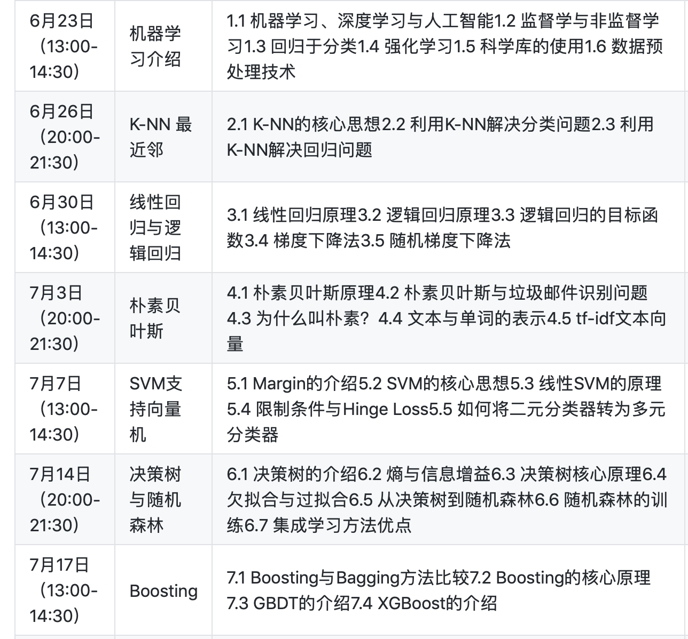
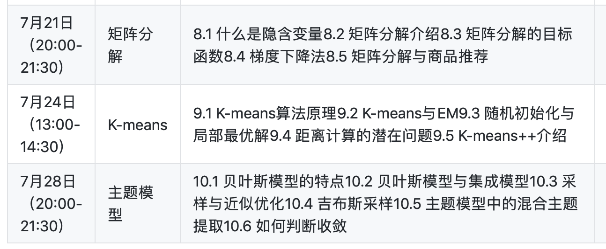

# Machine Learning Models
KNN+Naive Bayes+Linear Regression +SVM+Random Forest+ K-means +Boosting +Recommendation 

This is the machine learning course teaching by GreedyAI, for each model, we have a prectice hands-on project to practice.

## Course Syllabus

